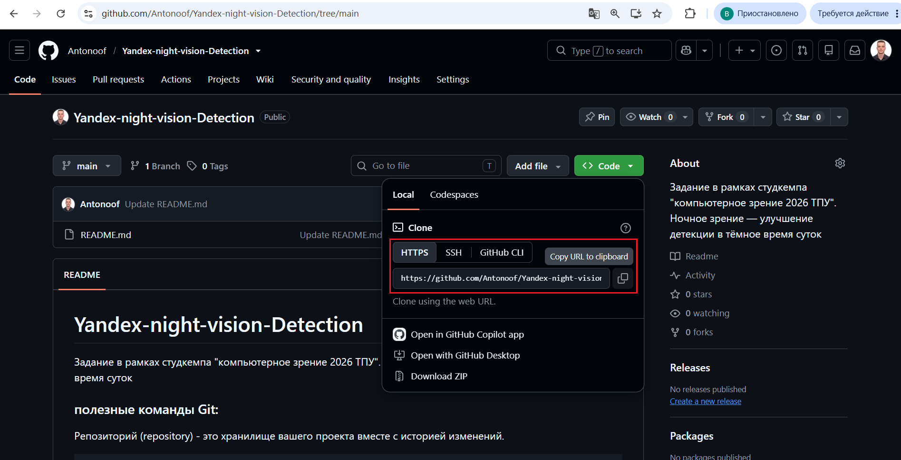

# Yandex-night-vision-Detection
Задание в рамках студкемпа "компьютерное зрение 2026 ТПУ". Ночное зрение — улучшение детекции в тёмное время суток

### полезные команды Git:

Репозиторий (repository) - это хранилище вашего проекта вместе с историей изменений.
```
# Клонирование существующего репозитория
git clone <url>
```

Добавление файлов в индекс
```
# Добавление файла в индекс
git add <файл>

# Добавление всех измененных файлов
git add .
git add -A
```

Коммит - это снимок состояния проекта в определенный момент времени.
```
# Создание коммита
git commit -m "Сообщение коммита"
```

Ветка - это независимая линия разработки. Ветки позволяют разрабатывать функциональность изолированно.
```
# Создание новой ветки
git branch <имя_ветки>

# Переключение на ветку
git checkout <имя_ветки>

# Создание и переключение на новую ветку
git checkout -b <имя_ветки>

# Просмотр всех веток
git branch
```

Проверка статуса
```
# Проверка статуса репозитория
git status
```

Работа с удаленными репозиториями
```
# Отправка изменений
git push origin <имя_ветки>
```

остальное: [Шпаргалка Git](https://gist.github.com/dmitry-osin/c9aab2c594050c72e56d56eafbb925d2)

Как я создал свою ветку:
```
git clone <url>
# Потом зайти в папку с проектом и вводить команды ниже
git checkout -b <имя_ветки>
git push origin <имя_ветки>
```

Url брать:



### 🗂️ Git Structure(По веткам):
```
main - основная ветка её не трогаем она для сдачи проекта
develop - ветка для будущего мёрджа(объединения всех веток)
Synthetic - ветка для синтетики (Антонов Артём)
3lc - ветка для метода 3LC(разметка данных, дообучение и т.д, сердце проекта с него будет стартовать код) (Дамир Искулов)
clustering-dino - ветка для Dino(или другой) модели, которая будет забирать часть разнородных данных для обучения и валидации. (Александр)
augmentations - ветка с обзором всех аугментаций, подходов и гипотез которые пробовали для улучшения качества. (Гоша)
model-benchmark - ветка с результатами и сравнением моделей которые пробовали(сравнивать будем до/после). (Никита)
```
